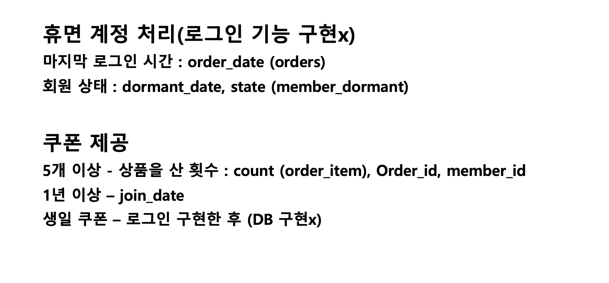
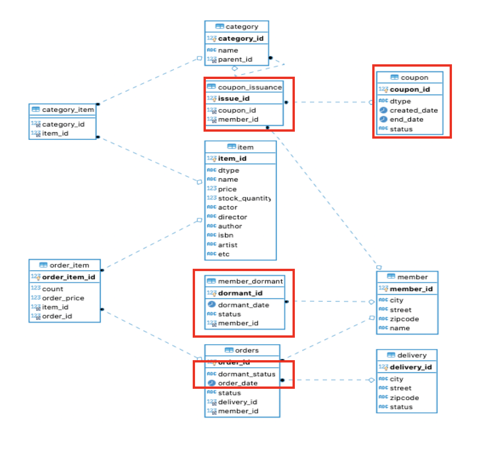

# spring-batch-project
스프링 부트 웹서비스, 스프링 배치


* 김영한 님의 jpa 강의를 듣고 생성된 jpa shop 에 맞는 스프링 배치를 작성해보자







```
insert into orders (order_date, status, delivery_id, member_id) value(date_add(now() ,interval -3 month), 'ORDERED', 4,2);
```


```
insert member (city, street, zipcode, dormant_status, join_date, name) values ("서울", "1","111","ACTIVE",now(), "userC");

```


```
insert into orders (order_date, dormant_status, status, delivery_id, member_id) value(date_add(now() ,interval -3 month),'NOTDONE', 'ORDERED', 9,3);

insert into orders (order_date, dormant_status, status, delivery_id, member_id) value(date_add(now() ,interval -3 month),'NOTDONE', 'ORDERED', 4,4);

select * from orders;

select * from member;

select * from member_dormant;

```


```
➜  main tree
.
├── java
│   └── com
│       └── batchprogram
│           ├── BatchprogramApplication.java
│           ├── Incrementer
│           │   └── CurrentTimeIncrementer.java
│           ├── configuration
│           │   ├── BatchConfiguration.java
│           │   ├── DormantConfiguration.java
│           │   ├── MDWriter.java
│           │   ├── OrderReader.java
│           │   └── OrderWriter.java
│           ├── dao
│           │   ├── MemberDormantDao.java
│           │   └── OrderDao.java
│           ├── domain
│           │   └── member
│           │       ├── Member.java
│           │       ├── MemberRepository.java
│           │       └── MemberStatus.java
│           ├── job
│           │   ├── SimpleJobConfiguration.java
│           │   └── unPaidMemberConfig.java
│           ├── listener
│           │   ├── ChunkExecutionListener.java
│           │   ├── JobCompletionNotificationListener.java
│           │   └── StepExecutionNotificationListener.java
│           ├── model
│           │   ├── DormantStatus.java
│           │   ├── MemberDormant.java
│           │   └── Order.java
│           └── processor
│               ├── Dormant2BatchProcessor.java
│               └── DormantTestItemProcessor.java
└── resources
    ├── application
    ├── application.properties
    ├── import.sql
    ├── logback-spring.xml
    └── mybatis
        ├── md
        │   └── SqlMapper.xml
        ├── mybatis-config.xml
        └── order
            └── SqlMapper.xml

16 directories, 29 files

```

